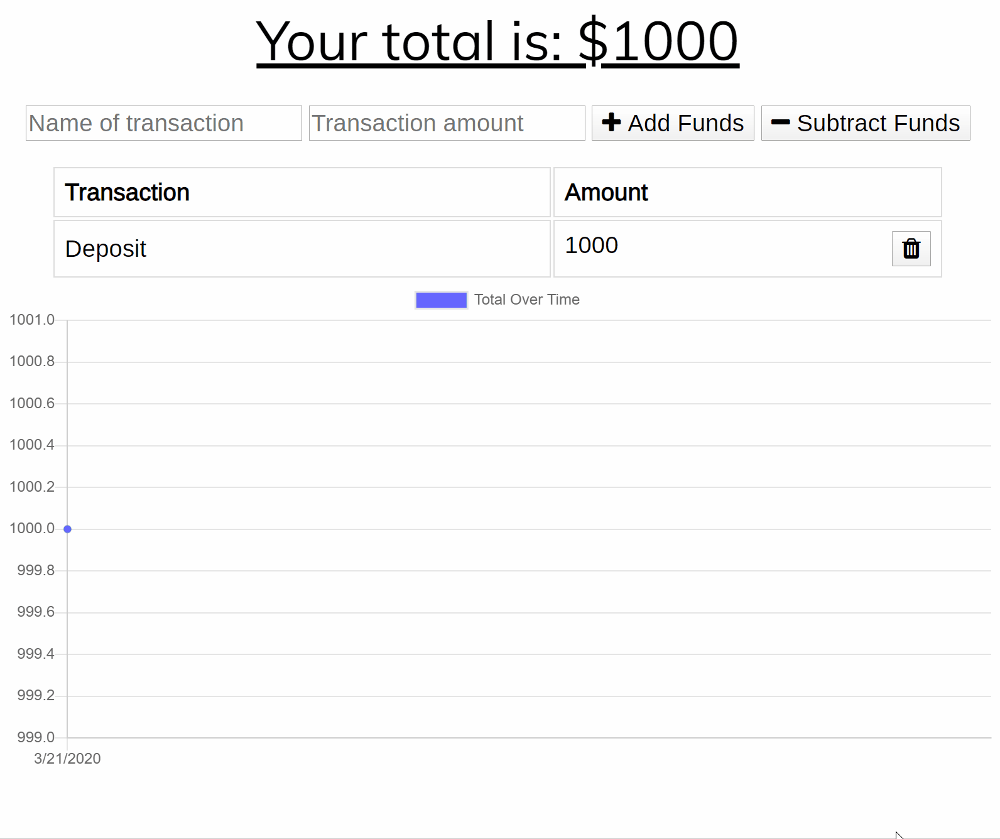

# Budget-Trackers
Progressive Web Application that enables users to keep track deposits/withdrawals with or without a data/internet connection.

# Features
- Online functionality:
    - Enter deposits
    - Enter expenses
    - Delete any transactions
- Offline functionality:
    - Enter deposits
    - Enter expenses
    - Offline transactions are added to tracker even when the app is refreshed while offline
    - Users are notified when they are offline and trying to enter transactions
    
# Screenshots

# Tech/framework used
* Programming Languages: JavaScript, HTML, CSS
* Browser Based Technologies: Caches, IndexedDb, Responsive Design, Toast
* Databases: Mongoose
* Deployment: Heroku, Git
* Server-Side Deployment: Express.js, Node.js
* Library/Package: Compression, Morgan, Chart.js
* Other tools: Visual Studio Code

# Live link
* [Budget-Trackers](https://young-journey-67191.herokuapp.com/) 
